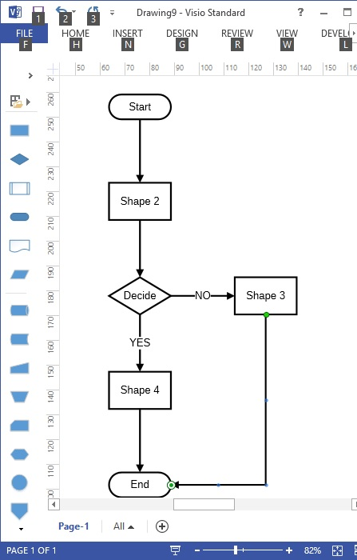

# PythonVisioFlowchart 

This program uses Python to create a flowchart on a Visio document. Visio 2013 standard, 32 bit Python 2.7 for Windows and the 32 bit version of win32com were used when this program was created.

Visio must be open before running this program. Open Visio, select NEW then select "Basic Diagram".  You can now run the program and it will create a flowchart.

